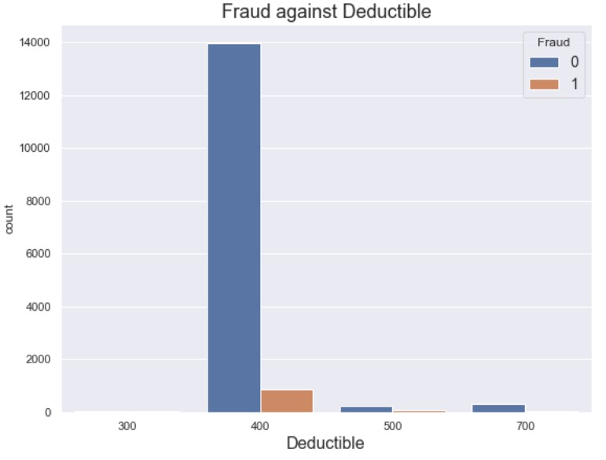
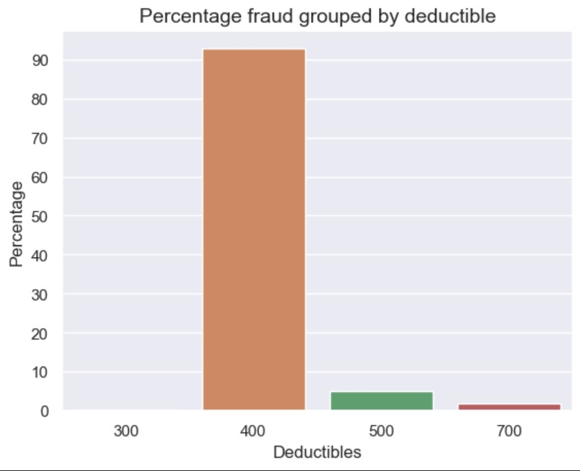
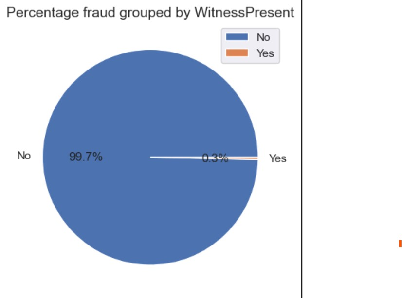
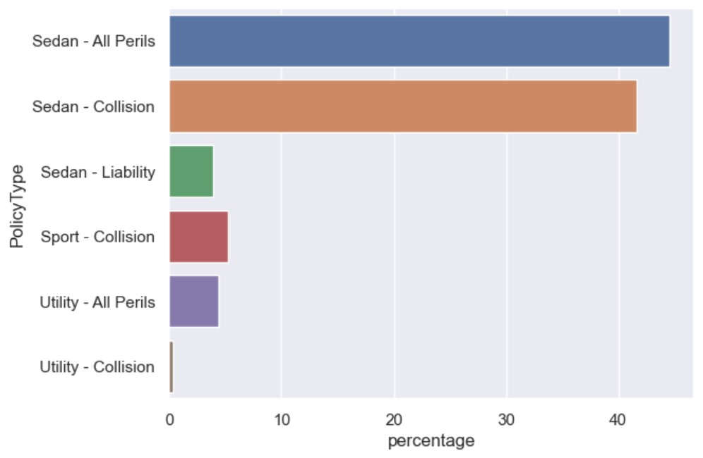
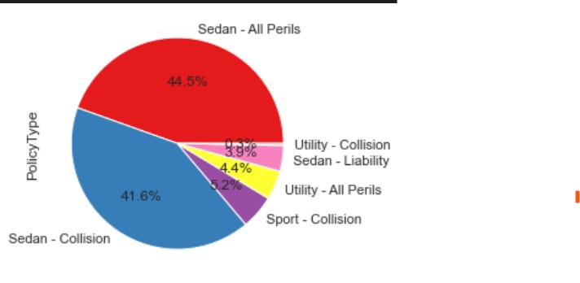
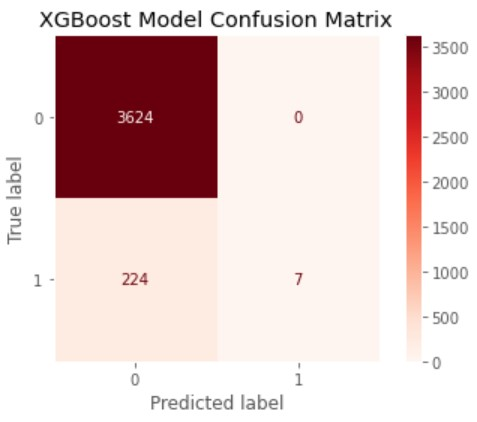

# Car Claims - Data Analysis & Predictive Modelling
This project aims to develop the best ML model for the predictive classification of car claims being fraudulent or not by identifying a problem, gathering and cleaning the data, analysing the information from the data, and choosing a suitable model. The dataset can be found [here](https://www.kaggle.com/datasets/khusheekapoor/vehicle-insurance-fraud-detection). 
To understand how to run this project on your local machine, please go to the 'How to run on local' section of the readme.

## Business Goals/Problem Statement
XYZ car insurance company has around 15k hostorical claims data. Out of these, some of them are fraud claims just to take money from the company. The company wants to identify the drivers of the claims being fraud.
I will analyse the data for trends in the historical data to identify patterns and find out the features leading to the fraudulent claims, support the decision making of the business by which features are contributing to the fraud claims and what patterns the fraudsters use while putting up a fraud claim. I will also develop a predictive model to predict fraud claims and how does it impact to the business.

## Folder Structure
### Car_Claims_Fraud_Prediction

### Folders

## Data Analysis
My initial approach was to analyse the data by getting the summary of the data including missing values, NaNs, statistical analysis, how the data is distributed, how each feature is correlated with the target variable and how also validating multi-colinerity. The findings of the analysis can be found below.

The dataset had about 1k fraud claims which is just 6% of the entire dataset. 

The graphs below show the fraud claims with respect to deductibles in each claim. We can identify that more than 92% of the frauds in the data have a deductible of 400. Most of the claims having deductible 400 are prone to being fraud and the business must make note of it. Further we will see other features contributing to narrow down the deductible of 400 being fraud and find distinct patterns.

  
  

In the historical data, 99.7% of the fraud claims had no witnesses during the time of accident. The fraudsters do not put witnesses to avoid validation of the claim whether it is genuine or fraud, by the company, through contacting the witness.

  

More than 85% of the fraudulent claims are of collision and all peril policy types for a particular sedan vehicle types.

  
  

## Modelling and Results
Different predictive models were implemented to predict whether a claim is fraud or not depending on the features from the historical data provided. The XGBoost model yeilded the best results with a accuracy of 94%, this means that if a sample of 100 policy claims are given the model predicts 94 of them correctly as fraud or not fraud.

As there are thousands of claims made, it is impossible to validate each and every claim manually for fraudulent behaviours, it becomes time consuming and requires a lot of resources and manual work. To address this problem and narrow down the number of claims to be validated, the model was built. This model will determine which of the claims are prone to being fraudulent by learning from the historical data, so only those claims which the model predicts to be fraudulent must be manually validated. There are cases where the model might predict a fraud claim as non fraud and therefore I have fine tuned to model to reduce these cases as well so as to improve productivity.

In the below figure, there are 3855 claims sent to the model. Manually, it will take a lot of time to validate all the 3855 claims, but as you can see the model predicted frauds (i.e 1's) is just 7 and the frauds predicted as non-frauds is 224. So a total of 231 records are to be validated, by this the number has been reduced drastically and help the business to make decisions faster.

  

## How to run on local
Navigate to the 'src->components' folder vis CLI/terminal. The 'model_dispatcher.py' has all the models in it. If you want to add any model, you can add it there. The 'model_hyperparameters.py' has the hyperparameter tuning of the models. 

To train all the models at once run the below line in the command line interface (CLI). This will output all the models in the artifacts folder. The logs can also be seen there.

python train_all_models.py

To train specific model from the CLI, run the below line.

python train_specific_model.py --model random_forest_gini

This will output the model in the artifacts folder. The general syntax to run specific models is given below.

python train_specific_model.py --model (model_name from model_dispatcher.py)

